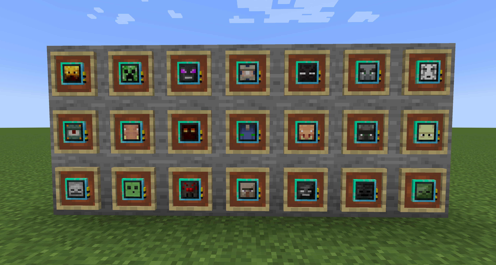
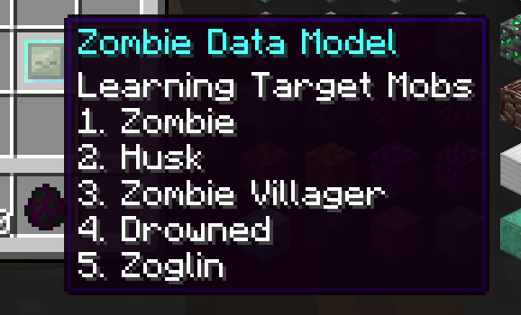

# DeepMobLearningReloaded

**DeepMobLearningReloaded** は、Deep Mob Learning: Reforgedをベースに対応するデータモデルを追加したMODです。

追加したデータモデルのMob
- エルダーガーディアン
- エヴォーカー
- ホグリン
- マグマキューブ
- ファントム
- ピグリン
- ラヴェジャー
- ウォーデン

計21種類のデータモデル

データモデルの学習できるモブの一覧はデータモデルをマウスオーバーした状態で「Ctrl」を押すことで確認することができます。また、MOD間連携で追加されたモブも同様に確認することができます。

## MOD間連携

DeepMobLearningReloadedはいくつかのMODと連携をしています。MOD連携には段階があります。

Level1：既存のデータモデルに対して討伐対象モブとして追加や綺麗なマターで生産できるモンスタードロップ品の追加を行う連携。  
Level2：Level1に加えて対象のMODで追加されるモブのデータモデルや綺麗なマターを追加します。

### Level1

Level1の連携は以下のMODに対応しています。

- [Reliquary Reincarnations](https://www.curseforge.com/minecraft/mc-mods/reliquary-reincarnations)
- [DivineRPG (Official)](https://www.curseforge.com/minecraft/mc-mods/official-divinerpg)
- [Mekanism Additions](https://www.curseforge.com/minecraft/mc-mods/mekanism-additions)

### Level2

Level2の連携は以下のMODに対応しています。

- [Deeper and Darker](https://www.curseforge.com/minecraft/mc-mods/deeperdarker)

### その他

- レシピ表示：[Just Enough Items (JEI)](https://www.curseforge.com/minecraft/mc-mods/jei)
- 学習装置用の専用スロット追加：[Curios API (Forge)](https://www.curseforge.com/minecraft/mc-mods/curios)

## [参考MOD]

- [Deep Mob Learning](https://www.curseforge.com/minecraft/mc-mods/deep-mob-learning), by [IterationFunk](https://legacy.curseforge.com/members/iterationfunk/projects)
- [Deep Mob Learning: Reforged](https://www.curseforge.com/minecraft/mc-mods/deep-mob-learning-reforged), by [yollotwitch](https://legacy.curseforge.com/members/yollotwitch/projects)

## Original mod description

This mod however uses "Data models" that you train by defeating monsters both by hand or by simulation(In the simulation chamber).

To get started you will need a Deep Learner, which will house the data models, and some type of mob data model.

Once your data models have reached higher tiers you can use them in the Simulation Chamber to get "Transmutational" matter, you'll get different ones depending on which type the Data Model is. multiple Data Models can share the same type.

Overworld mobs -> Overworldian matter
Nether mobs -> Hellish matter
End mobs -> Extraterrestrial matter

These can be used to transmute items that come from that corresponding dimension/origin.

## ライセンス

本ModはMITライセンスを適用しています。詳細はLICENSE.txtを参照してください。