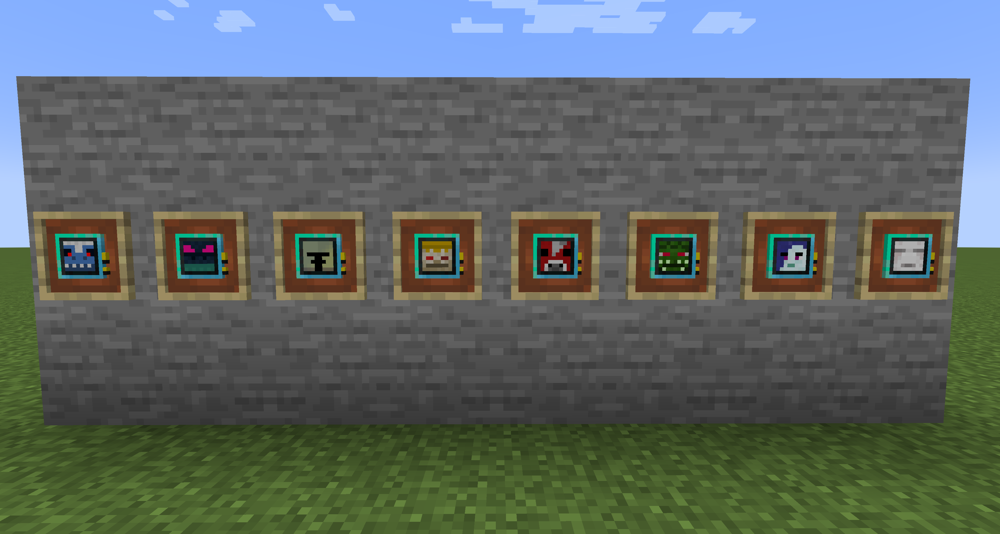

# DeepMobLearningReloaded

**DeepMobLearningReloaded** は、Deep Mob Learning: Reforgedをベースに外部MODとの連携をしやすくなるように変更したMODです。

[参考MOD]

- [Deep Mob Learning](https://www.curseforge.com/minecraft/mc-mods/deep-mob-learning), by [IterationFunk](https://legacy.curseforge.com/members/iterationfunk/projects)
- [Deep Mob Learning: Reforged](https://www.curseforge.com/minecraft/mc-mods/deep-mob-learning-reforged), by [yollotwitch](https://legacy.curseforge.com/members/yollotwitch/projects)

敵対モブ21種類のデータモデルを追加

データモデルの学習できるモブの一覧はデータモデルをマウスオーバーした状態で「Ctrl」を押すことで確認することができます。

## Original mod description

This mod however uses "Data models" that you train by defeating monsters both by hand or by simulation(In the simulation chamber).

To get started you will need a Deep Learner, which will house the data models, and some type of mob data model.

Once your data models have reached higher tiers you can use them in the Simulation Chamber to get "Transmutational" matter, you'll get different ones depending on which type the Data Model is. multiple Data Models can share the same type.

Overworld mobs -> Overworldian matter
Nether mobs -> Hellish matter
End mobs -> Extraterrestrial matter

These can be used to transmute items that come from that corresponding dimension/origin.

## Twilight Forestとの連携

TwilightForestのボス8種類のデータモデルを追加

## License

This project is licensed under the MIT License, see the LICENSE.txt file for details
